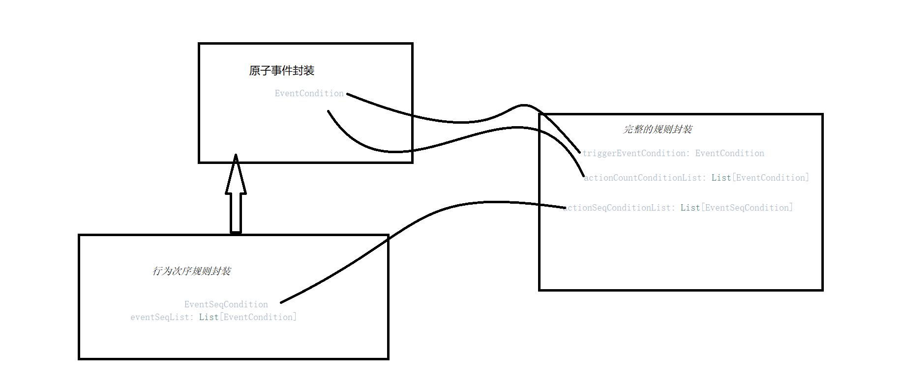

# 1，系统概述

## 1.1 业务场景
对用户在网页或手机端等产生的浏览商品，购买商品行为进行分析处理。
从中获取对产品有益的数据，帮助产品更好的分析用户和推送用户想要的商品。

## 1.2 业务流程

用户的所有的行为都封装成一个事件，发送到kafka。

Flink去实时消费kafka中的数据（用户行为明细），根据给定的规则，判断是否满足，如果满足就往kafka发送一条消息，后续由业务系统进行消费。

## 1.3 规则

首先是触发条件，只有满足触发条件，才会进入规则匹配，也就是说触发条件是规则匹配的入口。

其次，是用户画像条件，比如用户性别、年龄，职业，出生地....。用户画像条件存在hbase中，根据用户Id去hbase中查询，如果满足用户画像条件，继续进行后续的规则匹配。

用户行为次数类条件，比如购买A商品的次数超过3次, B商品加入购物车的次数超过2次。

用户行为序列类条件，比如用户依次购买A商品，B商品，C 商品。

## 1.4 数据存在哪里

画像类条件查询hbase，rowkey是用户ID

行为次数类条件，如果是2小时内的，查询flink的状态。如果超过2小时，那么就从clickhouse中查询。

select 事件id, count(*) from event where userId = '' group by  事件id

行为序列类条件：A -> B -> C

# 2,  系统开发流程 (迭代式开发)
## 2.1 版本一
静态规则，规则的生成和所有的匹配流程都写在processFunction中，代码耦合性高

## 2.2 版本二
- 规则模拟放到一个工具类中
- 原子规则封装到一个bean中
```
eventId  -> 事件Id
eventProps: Map[String, String] ->  事件属性
timeRangeStart   ->  规则的查询起始时间
timeRangeEnd  ->  规则的查询结束时间
minLimit  ->  规则中要求事件需要完成的最小次数限制
maxLimit  ->  规则中要求事件需要完成的最大次数限制
```
-- 完整的规则也封装到一个bean中
```
                          /**
                           * 规则Id
                           */
                          ruleId: String,

                          /**
                           * keyby的字段, 使用逗号分割，例如:  "province,city"
                           */
                          keyByFields: String,

                          /**
                           * 规则触发条件
                           */
                          triggerEventCondition: EventCondition,

                          /**
                           * 用户画像属性条件
                           */
                          userProfileConditions: Map[String,(String, String)],

                          /**
                           * 行为次数类规则条件
                           */
                          actionCountConditionList: List[EventCondition],

                          /**
                           * 行为次序类条件
                           */
                          actionSeqConditionList: List[EventSeqCondition]
```


